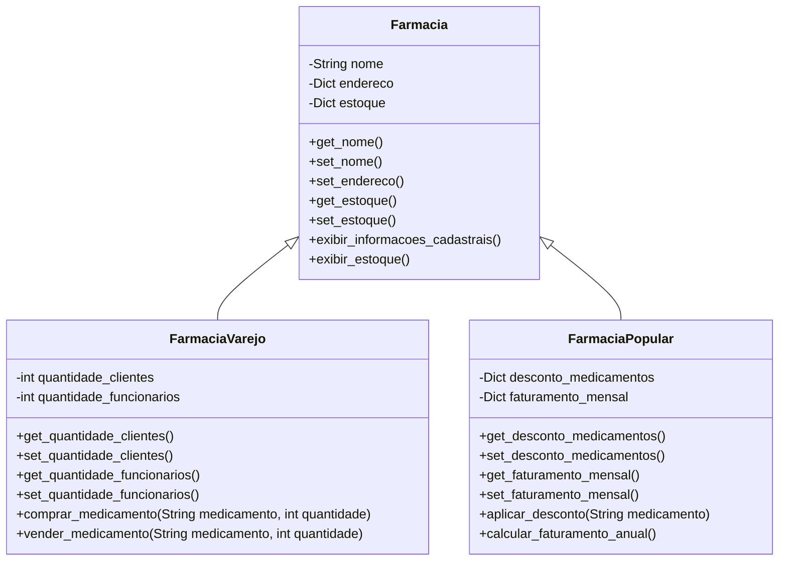

# Relatório #

**01. Introdução**

O presente trabalho apresenta a hierarquia de uma Farmácia (classe base abstrata) e duas subclasses suas, que abstraem os conceitos de Farmácia de Varejo (FarmaciaVarejo) e de Farmácia Popular (FarmaciaPopular).

A abstração de uma Farmácia levou em consideração sua presença no cotidiano da maior parte das pessoas. No caso, atributos como nome, endereço, estoque, clientes, funcionários, descontos e convênios são regularmente lembrados.

Embora apenas duas subclasses tenham sido escolhidas, outras poderiam ser modeladas, a exemplo de Farmácia de Atacado e Farmácia Hospitalar.

**02. A hierarquia.**

A classe Farmacia é a **classe base abstrata**. Ela possui como atributos alguns elementos mínimos que permeiam toda a ideia que se tem de uma Farmácia, isto é, aquilo que frequentemente se imagina quando se pensa numa _farmácia_: nome [_nome_], endereço [_endereco_] e medicamentos à disposição [_estoque_]. Seus métodos, além dos acessores e mutadores, incluem a exibição de dados cadastrais [*exibir_informacoes_cadastrais()*] e do estoque [*exibir_estoque()*].

A subclasse FarmaciaVarejo é a abstração de uma Farmácia de Varejo (farmácia que vende ao consumidor final em pequenas quantidades). Por ser uma subclasse, ela **herda** os atributos e métodos da classe base (Farmacia), embora possua e **encapsule** seus próprios atributos: a quantidade de clientes [*quantidade_clientes*] e a quantidade de funcionários [*quantidade_funcionarios*]. Seus métodos próprios, além dos acessores e mutadores, incluem a aquisição de medicamentos para o estoque [*comprar_medicamento()*] e a venda de medicamentos ao consumidor final [*vender_medicamento()*].

A subclasse FarmaciaPopular é a abstração de uma Farmácia Popular (farmácia que vende ao consumidor final com descontos avantajados, geralmente em razão de subsídios e
subvenções governamentais). Novamente, em razão da **herança**, ela herda os atributos e métodos da classe base (Farmacia), bem como **encapsula** seus atributos particulares: o percentual de desconto de um dado medicamento [*desconto_medicamentos*] e o faturamento mensal [*faturamento_mensal*]. Seus métodos, além dos acessores e mutadores, incluem a aplicação de desconto numa dada venda [*aplicar_desconto()*] e o cálculo do faturamento anual [*calcular_faturamento_anual()*].

Uma representação gráfica das classes e de como elas estão interligadas - por meio da herança - pode ser conferida no diagrama de classes abaixo:

### Diagrama de Classes

**03. Relatório de cobertura do código.**

Para determinação dos percentuais de desenvolvimento do código, foram contabilizados todos os métodos de cada classe, ficando a distribuição do seguinte modo:

1. classe Farmacia: 8 métodos
* 50%: 4 métodos

* 80%: 6 métodos

* 100%: 8 métodos

2. classe FarmaciaVarejo: 6 métodos
* 50%: 3 métodos

* 80%: 5 métodos

* 100%: 6 métodos

3. classe FarmaciaPopular: 6 métodos
* 50%: 3 métodos

* 80%: 5 métodos

* 100%: 6 métodos

**04. Conclusões.**

O presente trabalho consistiu na aplicação da metodologia TDD e da POO na elaboração de uma hierarquia de classes. A equipe buscou atender a todos os requisitos elaborados, atentando-se para a quantidade de níveis requerida, para a escolha de uma entidade/classe cotidiana (fugindo das tradicionais figuras geométricas), para o emprego adequado da abstração na modelagem das classes, para a elaboração da lista de requisitos suficientemente fechada e para o cuidado em necessariamente seguir a ordem proposta: levantamento de requisitos, planejamento e elaboração de testes e implementação do código.

É importante observar que a equipe decidiu não implementar fielmente todas as nuances de uma Farmácia, mas se ateve ao mínimo coerente e necessário para modelar tal entidade/classe, de sorte que fosse possível aplicar minimamente a metodologia TDD e de POO. Em razão disso, por exemplo, o atributo _estoque_ não armazena dados relacionados a **preço**, muito embora algo do tipo fosse esperado numa aplicação mais elaborada. Muito em razão disso, deixou-se de aplicar **polimorfismo**, inobstante fosse possível aplicá-lo ao método *vender_medicamento()*, na classe FarmaciaPopular: tal método teria um comportamento diferenciado, não apenas verificando o _estoque_, mas também checando a possível existência ou não de um _desconto_ para o _medicamento_ que se quer vender.

Por certa, tais melhorias podem ser aplicadas e implementadas em atualizações desse trabalho.