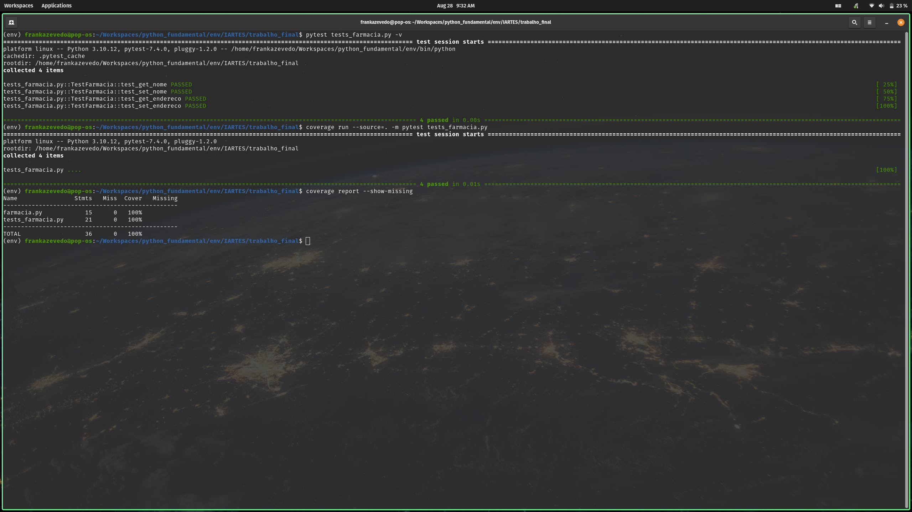
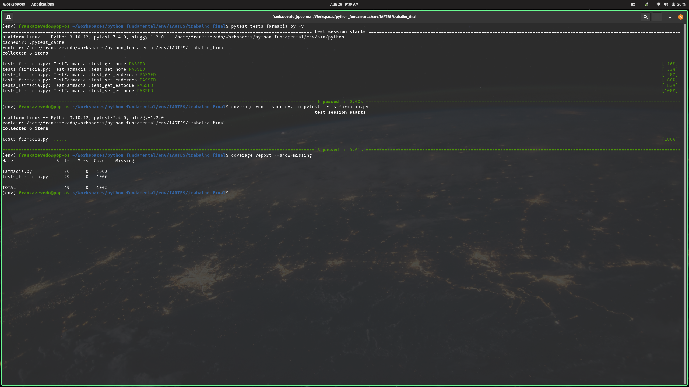

# Lista de Requisitos #

### Classe Farmacia:
1. O atributo _nome_ deve iniciar obrigatoriamente com um caracter alfabético e conter 30 caracteres no máximo

2. O atributo _endereco_ é um dicionário que deve seguir minimamente a estrutura abaixo. Importante ressaltar que uma [chave] não deve aceitar um [valor] vazio (''):
    ```
    endereco = {'rua' : '', 'numero' : '', 'complemento': '', 'bairro': '', 'cidade': '', 'estado' : '', 'país': ''}
    ```

3. Tanto o atributo _nome_ quanto as chaves do atributo _estoque_ devem ter seus caracteres alfabéticos armazenados no formato **Lower Case**. Os métodos mutadores devem garantir e validar este requisito.

4. O atributo _estoque_ é um dicionário com a seguinte estrutura obrigatória:
    ```
    estoque = {'medicamento' : 'quantidade', ...}
    ```

5. A _quantidade_ [valor] deve ser armazenada como string, embora retrate um inteiro, cujo valor default é 0.0 (zero) e, eventualmente, possa ser negativo.

6. Métodos acessores e mutadores: *get_nome()*, *set_nome()*, *get_endereco()*, *set_endereco()*, *get_estoque()* e *set_estoque()*

7. O método *exibir_informacoes_cadastrais()* deve imprimir uma string formatada contendo o atributo _nome_ e o atributo _endereco_; se algum desses atributos não estiver presente, uma **mensagem de erro** _Cadastro incompleto ou inválido_ deve ser impressa

8. O método *exibir_estoque()* deve imprimir uma string formatada do _estoque_, do seguinte modo:
    ```
    Estoque
    Medicamento 1: xx unidade(s)
    Medicamento 2: yy unidade(s)
    ...
    Medicamento N: ww unidade(s)
    ```

### Classe FarmaciaVarejo:
1. O atributo *quantidade_clientes* deve ser um inteiro não negativo.

2. O atributo *quantidade_funcionarios* deve ser um inteiro não negativo.

3. Métodos acessores e mutadores: *get_quantidade_clientes()*, *set_quantidade_clientes()*, *get_quantidade_funcionarios()*, *set_quantidade_funcionarios()*, *get_faturamento_mensal()* e *set_faturamento_mensal()*

4. O método *comprar_medicamento (medicamento: string, quantidade: int)* deve representar a aquisição/entrada de medicamentos para o estoque, isto é, o método deve modificar positivamente o atributo _estoque_. Para tanto:
(1) se a _quantidade_ [valor] indicada do _medicamento_ [chave] for igual a ou menor que 0 (zero), uma **mensagem de erro** _Quantidade inválida_ será impressa.
(2) se o _medicamento_ [chave] já existe no dicionário _estoque_, o método apenas incrementará a _quantidade_ [valor] existente.
(3) se o _medicamento_ [chave] ainda não existe no dicionário _estoque_, o método deve criar uma nova entrada no dicionário _estoque_.

5. O método *vender_medicamento (medicamento: string, quantidade: int)* deve representar a saída de medicamentos do estoque, isto é, o método deve modificar negativamente o atributo _estoque_. Uma venda só é realizada:
(1) se o _medicamento_ [chave] já existe no dicionário _estoque_; e
(2) se a _quantidade_ indicada [valor] do _medicamento_ [chave] não for superior à _quantidade_ [valor] constante no _estoque_:

6. Uma venda não será realizada:
(1) se a _quantidade_ [valor] indicada do _medicamento_ [chave] for igual a ou menor que 0 (zero). Nessa situação, uma **mensagem de erro** _Quantidade inválida_ será impressa.
(2) se a _quantidade_ [valor] indicada do _medicamento_ [chave] for superior à _quantidade_ [valor] já registrada no _estoque_. Uma **mensagem de erro** _Quantidade solicitada superior à disponível no Estoque_ deverá ser impressa
(3) se o _medicamento_ [chave] não existe no dicionário _estoque_. Uma **mensagem de erro** _Medicamento inexistente no Estoque_ será impressa

### Classe FarmaciaPopular:
1. O atributo *desconto_medicamentos* é um dicionário que representa os medicamentos e seus respectivos descontos. Ele possui a seguinte estrutura obrigatória:
    ```
    desconto_medicamentos = {'medicamento' : 'desconto', ...}
    ```
2. O _desconto_ [valor] deve ser armazenado como string, embora retrate um número real. Esse valor não pode ser negativo; caso seja, nenhuma alteração ocorrerá.

3. O atributo *faturamento_mensal* é um dicionário com a seguinte estrutura obrigatória:
    ```
    faturamento_mensal = {'mes' : 'faturamento_do_mes', ...}
    ```
4. A chave do atributo *faturamento_mensal* só admite caracteres alfabéticos, e no formato **Lower Case*. Quer a chave _março_, quer a chave _marco_, ambas são válidas.

5. O *faturamento_do_mes* [valor] deve ser armazenado como string, embora retrate um número real e, eventualmente, possa ser negativo.

6. Métodos acessores e mutadores: *get_desconto_medicamentos()*, *set_desconto_medicamentos()*, *get_convenios()* e *set_convenios()*

7. O método *aplicar_desconto (medicamento: string)* deve retornar o valor do percentual de _desconto_ de um dado _medicamento_. Para tanto, uma consulta ao atributo _estoque_ e ao atributo *desconto_medicamentos* deve ser realizada. Se o _medicamento_ ou o _convenio_ informado não existir naqueles atributos, retornar o valor 0.0 (zero).

8. O método *calcular_faturamento_anual()* deve retornar o somatório dos registros constantes no dicionário *faturamento_mensal*.

# Modelos válidos de objetos #

```
# nome: string
nome = 'Farma 10'

# endereco: dict
endereco = {'rua' : 'rua baker', 'numero' : '221b', 'complemento': '', 'bairro': '', 'cidade': 'londres', 'estado' : 'am', 'país': 'br'}

# estoque: dict
estoque = {'dipirona' : '10', 'ibuprufeno' : '2', 'aspirina' : '0', ...}

# faturamento_mensal: dict
faturamento_mensal = {'janeiro' : '2000.00', 'fevereiro' : '0.0', 'março' : '-100.00', ...}

# desconto_medicamentos: dict
desconto_medicamentos = {'dipirona' : '0.12', 'ibuprufeno' : '0.4', 'aspirina' : '0.0', ...}

```
# Estrutura do Relatório #

**01. Introdução**

*Apresente em que contexto a sua hierarquia está inserida, quais são as abstrações que ela descreve.*

O presente trabalho apresenta a hierarquia de uma Farmácia (classe base abstrata) e duas subclasses suas, que abstraem os conceitos de Farmácia de Varejo (FarmaciaVarejo) e de Farmácia Popular (FarmaciaPopular).

A abstração de uma Farmácia levou em consideração sua presença no cotidiano da maior parte das pessoas. No caso, atributos como nome, endereço, estoque, clientes, funcionários, descontos e convênios são regularmente lembrados.

Embora apenas duas subclasses tenham sido escolhidas, outras poderiam ser modeladas, a exemplo de Farmácia de Atacado e Farmácia Hospitalar.

**02. A hierarquia.**

*Apresente cada classe da hierarquia. Mostra os métodos e atributos de cada classe. Uma pequena frase para descrever a abstração representada. Nessa parte indique, quando for o caso, emprego dos conceitos de: a) herança; b) polimorfismo; c) encapsulamento.*

A classe Farmacia é a **classe base abstrata**. Ela possui como atributos alguns elementos mínimos que permeiam toda a ideia que se tem de uma Farmácia, isto é, aquilo que frequentemente se imagina quando se pensa numa _farmácia_: nome [_nome_], endereço [_endereco_] e medicamentos à disposição [_estoque_]. Seus métodos, além dos acessores e mutadores, incluem a exibição de dados cadastrais [*exibir_informacoes_cadastrais()*] e do estoque [*exibir_estoque()*].

A subclasse FarmaciaVarejo é a abstração de uma Farmácia de Varejo (farmácia que vende ao consumidor final em pequenas quantidades). Por ser uma subclasse, ela **herda** os atributos e métodos da classe base (Farmacia), embora possua e **encapsule** seus próprios atributos: a quantidade de clientes [*quantidade_clientes*] e a quantidade de funcionários [*quantidade_funcionarios*]. Seus métodos próprios, além dos acessores e mutadores, incluem a aquisição de medicamentos para o estoque [*comprar_medicamento()*] e a venda de medicamentos ao consumidor final [*vender_medicamento()*].

A subclasse FarmaciaPopular é a abstração de uma Farmácia Popular (farmácia que vende ao consumidor final com descontos avantajados, geralmente em razão de subsídios e
subvenções governamentais). Novamente, em razão da **herança**, ela herda os atributos e métodos da classe base (Farmacia), bem como **encapsula** seus atributos particulares: o percentual de desconto de um dado medicamento [*desconto_medicamentos*] e o faturamento mensal [*faturamento_mensal*]. Seus métodos, além dos acessores e mutadores, incluem a aplicação de desconto numa dada venda [*aplicar_desconto()*] e o cálculo do faturamento anual [*calcular_faturamento_anual()*].

Uma representação gráfica das classes e de como elas estão interligadas - por meio da herança - pode ser conferida no diagrama de classes abaixo:

### Diagrama de Classes


### Diagrama de Classes: ASCII
                                                        +----------------------------------+
                                                        |   Farmacia                       |
                                                        +----------------------------------+
                                                        | - nome: string                   |
                                                        | - endereco: dict                 |
                                                        | - estoque: dict                  |
                                                        +----------------------------------+
                                                        | +get_nome()                      |
                                                        | +set_nome()                      |
                                                        | +get_endereco()                  |
                                                        | +set_endereco()                  |
                                                        | +get_estoque()                   |
                                                        | +set_estoque()                   |
                                                        | +exibir_informacoes_cadastrais() |
                                                        | +exibir_estoque()                |
                                                        +----------------------------------+
                                                                        ^
                                                                        |
                                                                        |
                                        +-------------------------------+--------------------------------+
                                        |                                                                |
                                        |                                                                |
                                        v                                                                v
        +------------------------------------------------------------+            +----------------------------------------+
        | FarmaciaVarejo                                             |            | FarmaciaPopular                        |
        +------------------------------------------------------------+            +----------------------------------------+
        | - quantidade_clientes: int                                 |            | - desconto_medicamentos: dict          |
        | - quantidade_funcionarios: int                             |            | - faturamento_mensal: dict             |
        +------------------------------------------------------------+            +----------------------------------------+
        | +get_quantidade_clientes()                                 |            | +get_desconto_medicamentos()           |
        | +set_quantidade_Clientes()                                 |            | +set_desconto_medicamentos()           |
        | +get_quantidade_funcionarios()                             |            | +get_faturamento_mensal()              |
        | +set_quantidade_funcionarios()                             |            | +set_faturamento_mensal()              |
        | +comprar_medicamento(medicamento: string, quantidade: int) |            | +aplicar_desconto(medicamento: string) |
        | +vender_medicamento(medicamento: string, quantidade: int)  |            | +calcular_faturamento_anual()          |
        +------------------------------------------------------------+            +----------------------------------------+


**03. Relatório de cobertura do código.**

*Mostre a cobertura de código alcançada em cada estágio do desenvolvimento. Para isso considere a avaliação do código quando 50%, 80% e 100% do código tenha sido desenvolvido. Considere o número de métodos da classe para estabelecer as porcentagens indicadas anteriormente."*

Para determinação dos percentuais de desenvolvimento do código, foram contabilizados todos os métodos de cada classe, ficando a distribuição do seguinte modo:

1. classe Farmacia: 8 métodos
* 50%: 4 métodos



* 80%: 6 métodos



* 100%: 8 métodos


2. classe FarmaciaVarejo: 6 métodos
* 50%: 3 métodos


* 80%: 5 métodos


* 100%: 6 métodos


3. classe FarmaciaPopular: 6 métodos
* 50%: 3 métodos


* 80%: 5 métodos


* 100%: 6 métodos


**04. Conclusões.**

*"Apresente de forma resumida o que foi desenvolvido e os principais desafios."*

O presente trabalho consistiu na aplicação da metodologia TDD e da POO na elaboração de uma hierarquia de classes. A equipe buscou atender a todos os requisitos elaborados, atentando-se para a quantidade de níveis requerida, para a escolha de uma entidade/classe cotidiana (fugindo das tradicionais figuras geométricas), para o emprego adequado da abstração na modelagem das classes, para a elaboração da lista de requisitos suficientemente fechada e para o cuidado em necessariamente seguir a ordem proposta: levantamento de requisitos, planejamento e elaboração de testes e implementação do código.

É importante observar que a equipe decidiu não implementar fielmente todas as nuances de uma Farmácia, mas se ateve ao mínimo coerente e necessário para modelar tal entidade/classe, de sorte que fosse possível aplicar minimamente a metodologia TDD e de POO. Em razão disso, por exemplo, o atributo _estoque_ não armazena dados relacionados a **preço**, muito embora algo do tipo fosse esperado numa aplicação mais elaborada. Muito em razão disso, deixou-se de aplicar **polimorfismo**, inobstante fosse possível aplicá-lo ao método *vender_medicamento()*, na classe FarmaciaPopular: tal método teria um comportamento diferenciado, não apenas verificando o _estoque_, mas também checando a possível existência ou não de um _desconto_ para o _medicamento_ que se quer vender.

Por certa, tais melhorias podem ser aplicadas e implementadas em atualizações desse trabalho.